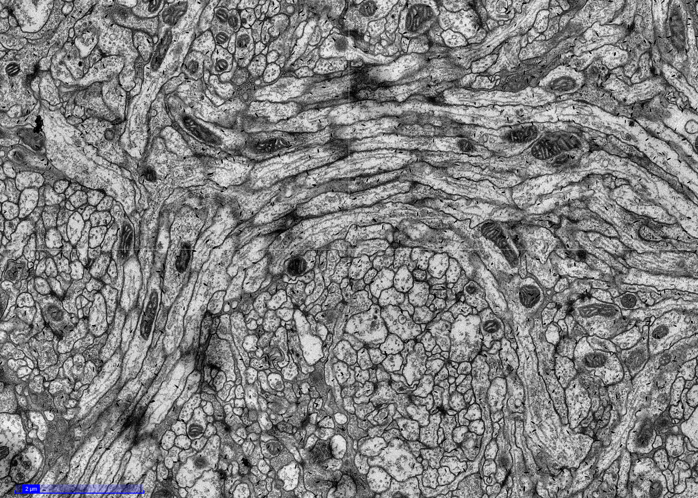
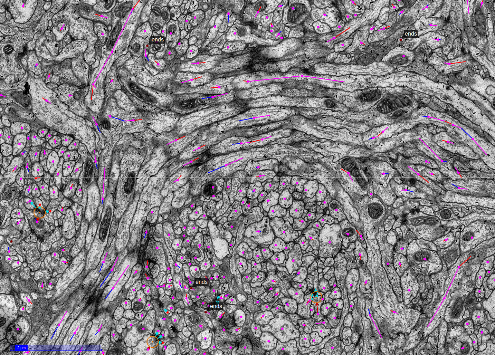
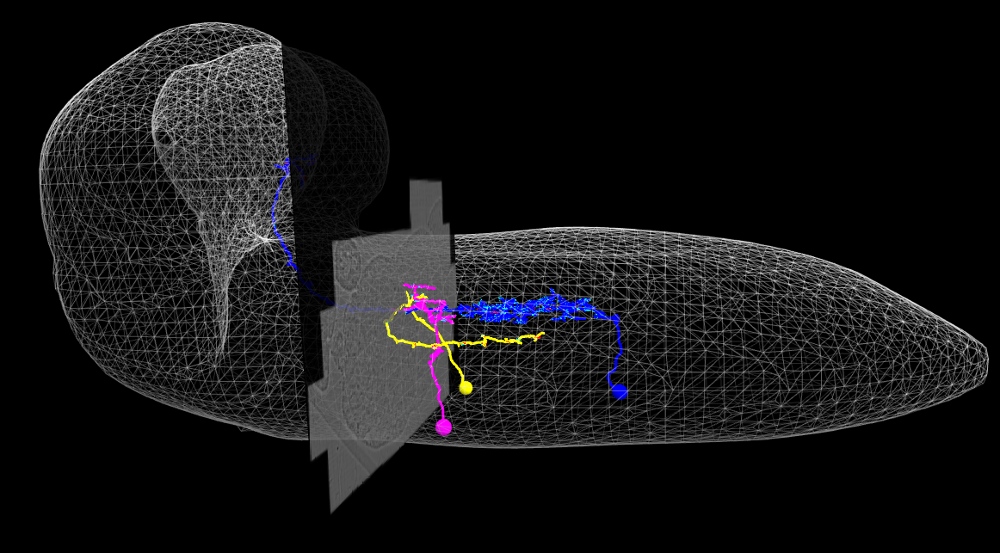
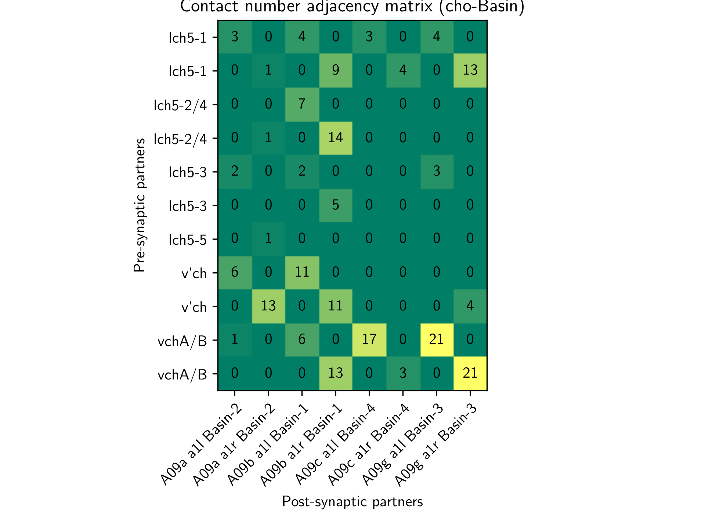
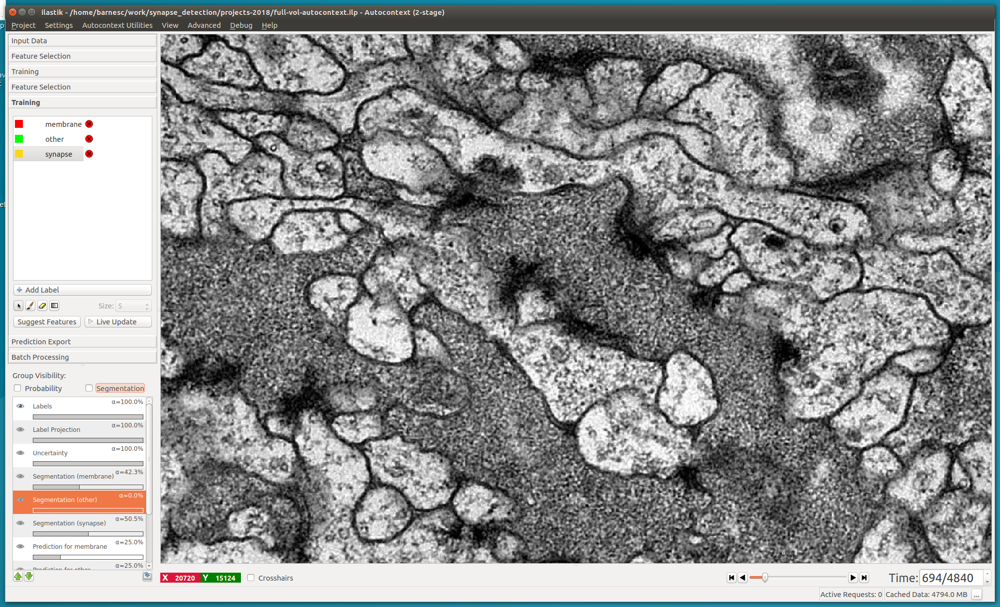
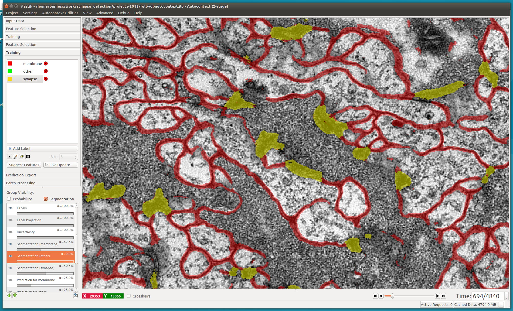
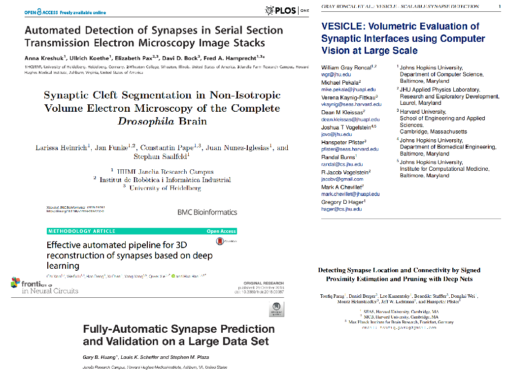
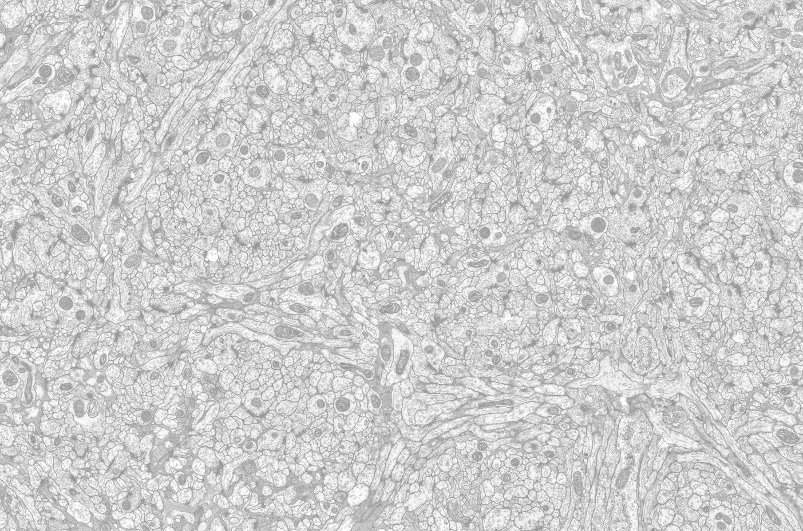

# Integrating Manual & Automatic Image Annotations

## Chris Barnes, Cardona lab

---

# The Lab

<!-- Take a terabyte-scale stack of EM images -->
(1) Raw EM stack

<!--Manually trace neurites - labour-intensive!-->
<!--Annotate synapses between cells to build towards a connectome-->
(2) Morphology/ connectivity

<!--Analyse those connections to infer meaningful circuits-->
(3) Circuitry

<!--Integrate this information with genetically-derived cell identity, behavioural and functional data-->
(4) ???

<!--How this little chunk of the nervous system does what it does-->
(5) PAPERS

---

# The Lab

<!--I'm going to focus on going from the images to the connectivity-->

(1) Raw EM stack

(2) Morphology/ connectivity

(3) Circuitry

(4) ???

(5) PAPERS

---

# Raw ssTEM images

<!--Screenshot from CATMAID-->
<!--200+kloc web application-->
<!--Where we do the bulk of our annotation and analysis-->

---

# Annotated ssTEM images

<!--We manually skeletonise these neurites-->
<!--annotate individual synaptic contacts-->

---

# Morphology

---

# Connectivity

<!--Stretch receptor sensory neurons onto first-order projection neurons 
in the first abdominal segment of drosophila larval CNS-->

---

<!--The problem is that this manual effort takes a long time-->

# The Problem {.big}

<!--This is a short talk, so I'm going to jump straight to-->

---

# The Solution {.big}

<!--Computers-->
<!--My particular interest is in synapses, but neurite tracing is also in the works-->

---

# Synapse detection

<!--Proof of concept, use ilastik: very user-friendly, small amount of training data needed,
see updates on the fly-->

---

# Synapse detection

<!--2-stage autocontext-->
<!--Hand-paint some sparse labels (this is the first stage, second stage is simpler)-->

---

# Synapse detection

<!--Results are actually pretty good-->

---

{.background}

<!--Fortunately, synapse detection is being worked on by a lot of people smarter than me-->
<!--many promising workflows-->

---

# Putting it all together

---

# CATMAID extensions

- Reduce barrier to entry for devs
- Different features for different servers
- Add:
  - Database tables
  - API endpoints
  - Frontend tools
<!--Previously, had to fork mainline catmaid and then manually merge updates-->
<!--Now, have your own project which can be installed in a catmaid environment with 3 commands (install, update database, collect frontend files)-->
<!--Asynchronous versioning-->
<!--CATMAID is currently not very discoverable, adding more widgets doesn't help that-->
<!--most of the power of a core developer-->
<!--Can work with just backend for scripting, or include GUI tools-->

---

# CATMAID-synapsesuggestor

- Sparse/ progressive population
- Integrates with existing spatial information
- Detector-agnostic
  - Compare results from different sources
<!--Only populate the data you're interested in (e.g. detected synapses in a known brain region-->
<!--Query for synapses near current features e.g. within 500nm of a specific neuron skeleton-->
<!--database-internal, and so very fast-->
<!--Different parametrisations of the same algorithm different algorithms etc-->
<!--Query which regions have been targeted with which algorithms-->
<!--Automatically detected partner information, if your detector supports it, can also be added and queried-->
<!--By default, separate from the connectivity information used in other widgets, 
(my proof-of-concept detector did not infer directionality) 
but realising automatic annotations as manual ones is a very simple process-->
  
---

# CATMAID-synapsesuggestor

@[youtube](NGbmXV09r9g)

---

# Links

This talk: github.com/clbarnes/jars-2019

Extension template: github.com/clbarnes/CATMAID-ext-cookiecutter/

CATMAID API in python: github.com/catmaid/catpy

---

# Acknowledgements

{.background}

**Cardona lab**

Albert Cardona

Andrew Champion

Tom Kazimiers

Will Patton

{.column}

**Collaborators**

Stuart Berg

Anna Kreshuk

Ilastik developers

**Graduate program**

Erik Snapp

Sue Jones

Bill Schafer

